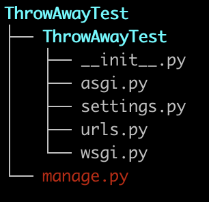

# Udemy Django Full Stack Web Developer Course

Notes and exercises for the [Udemy Python and Django Full Stack Web Developer Bootcamp](https://www.udemy.com/course/python-and-django-full-stack-web-developer-bootcamp/) course.


# Basic Django Workflow: Commands to Start Project, Create and App, and Create a Simple View

**Before step 1, need to activate conda env w/ Django**: `$ conda activate myDjangoEnv`

1. Create a project: `django-admin startproject ThrowAwayTest`. Note this will create files/folders like this: 

2. Go to the project directory: `cd ThrowAwayTest`
3. Create an app within the project: `python manage.py startapp AppTwo`
4. Create a new view by editing `views.py` within the app folder. Specifically, configure the HTML returned by a request like this:
```
from django.http import HttpResponse

def index(request):
    return HttpResponse("<em>My Second Project</em>")
```
6. Link the new view to a url by editing `urls.py` within the project sub-folder. Specifically, add something like this: 
```
from appTwo import views

urlpatterns = [
    path('', views.index, name='index'),
    path('admin/', admin.site.urls),
]
```

7. Edit settings.py to let project know that the app exists by adding the app to INSTALLED_APPS:
```
INSTALLED_APPS = [
    'django.contrib.admin',
    'django.contrib.auth',
    'django.contrib.contenttypes',
    'django.contrib.sessions',
    'django.contrib.messages',
    'django.contrib.staticfiles',
    'appTwo' # new app added here
]
```
8. Run the server locally to test it out: `python manage.py runserver`
9. Copy local host address into address bar to see the site


**NOTE:** the above workflow is not ideal. It's best practice to put another urls.py file inside of each individual app, then refer to that
file in your project folder using `django.conf.urls.include`. For an example, see `14-Django_Level_One/first_project`. Within this folder,
the first_project subfolder contains a `urls.py` file that references the `urls.py` file found in `first_app/urls.py`. This approach creates 
modularity, making it simpler to plug your apps into different Django projects.